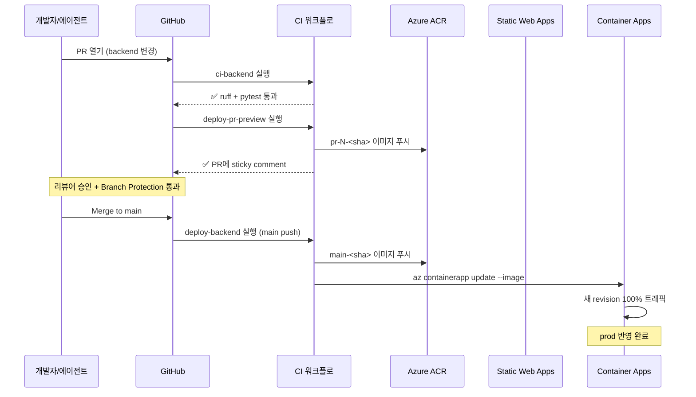
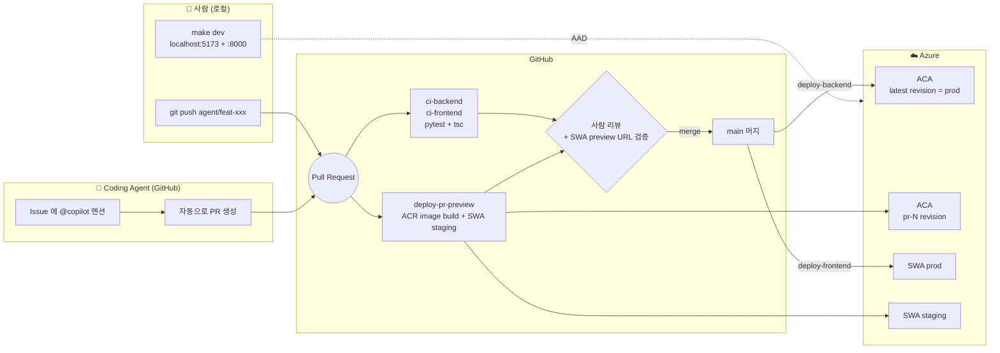

# Agentic DevOps — create-ad-cut

> **사람과 코딩 에이전트가 같은 main 브랜치를 공유하면서도 안전하게 병렬 개발하는 데모.**
>
> 로컬에서 즉시 띄울 수 있고, push 한 번에 GitHub Actions 가 Azure Container Apps + Static Web Apps 까지 자동 배포합니다. PR 마다 격리된 preview 환경이 자동 생성되어 사람이든 에이전트든 머지 전에 실제 URL 로 변경을 검증할 수 있습니다.

이 문서는 리포 전체를 *Agentic DevOps 데모* 관점에서 설명합니다. 앱 자체 기능 / 아키텍처는 [README.md](README.md), 인프라(IaC) 디테일은 [README.IaC.md](README.IaC.md) 를 참고하세요.

---

## 🎯 컨셉

**문제**: AI 코딩 에이전트가 메인 브랜치에 직접 손대면 위험합니다. 시크릿이 새거나, 인프라가 망가지거나, 사람과 충돌이 납니다.

**해법**: 4겹의 가드레일.

1. **브랜치 보호** — `main` 은 PR 머지만, CI 그린 + 1명 리뷰 필수
2. **CODEOWNERS** — `infra/`, `.github/workflows/` 는 사람만 승인 가능
3. **PR Preview** — PR 마다 격리된 ACA revision + SWA staging URL → 사람이 클릭 한 번으로 검증
4. **AAD-only 인증** — 코드에 키가 없음. 에이전트가 키 다룰 일 자체가 없음

이 4겹 위에서 사람은 로컬에서, 에이전트는 GitHub Issue/PR 로 동시에 일합니다.

---

## � CI/CD 개념 학습 (이 레포로 익히기)

> 이 섹션은 CI/CD가 처음인 사람을 위한 학습 자료입니다. 이미 익숙하다면 [🗺 전체 흐름](#-전체-흐름)으로 건너뛰세요.

### CI vs CD — 무엇을 풀려고 하는가

| | 풀려는 문제 | 핵심 질문 |
|---|---|---|
| **CI** (Continuous Integration) | 여러 사람이 동시에 코드 바꾸면 깨진다 | "이 변경이 main에 합쳐도 안전한가?" |
| **CD** (Continuous Deployment) | 사람이 손으로 배포하면 누락·실수가 생긴다 | "main에 들어간 코드가 자동으로 운영에 반영되는가?" |

GitHub Actions는 **이벤트 기반 자동화 엔진** — "어떤 이벤트가 일어났을 때 어떤 잡을 실행하라"의 규칙 묶음(yml)이 워크플로입니다.

### 각 워크플로의 "왜 존재하는가"

각 워크플로는 **하나의 질문**에 답하기 위해 있습니다.

#### 🔵 [`ci-backend`](.github/workflows/ci-backend.yml) — "백엔드 코드는 깨졌나?"
- **문제**: 누군가 `pip` 의존성을 잘못 고치거나 타입 에러가 있는 코드를 PR로 올리면? main에 들어가면 prod가 깨집니다.
- **해결**: PR이 열리는 순간 격리된 ubuntu VM에서 `ruff` (lint) + `pytest` (테스트) + `docker build` (이미지 빌드) 를 돌려서 "이 변경이 main에 들어가도 안전하다"를 증명.
- **차단력**: Branch Protection이 이 잡을 "필수"로 지정 → 실패하면 머지 버튼이 비활성화됨.

> 💡 **CI의 본질**: PR이 main에 합쳐졌을 때 일어날 일을 **미리 시뮬레이션** 해서 위험을 사전에 잡는 것.

#### 🔵 [`ci-frontend`](.github/workflows/ci-frontend.yml) — "프런트엔드 코드는 깨졌나?"
- `npm run typecheck` (TypeScript 타입 검증) + `npm run build` (Vite 빌드 통과)
- `frontend/**` 경로 변경 시에만 발동 → 불필요한 잡 안 돌림 (시간/비용 절약)

> 💡 **`paths:` 필터의 의미**: "백엔드만 고쳤는데 프런트 빌드까지 돌리는 건 낭비". 모노레포에서 워크플로를 효율적으로 쓰는 핵심 패턴.

#### 🟡 [`deploy-pr-preview`](.github/workflows/deploy-pr-preview.yml) — "이 PR이 실제 운영 이미지로 빌드되는가?"
- **문제**: `pytest`는 통과해도 컨테이너 빌드/푸시 단계에서 깨질 수 있음 (예: base image가 사라짐, ACR 권한 문제).
- **해결**: Azure에 진짜로 로그인해서 진짜 ACR에 진짜 이미지를 푸시. **운영과 같은 경로**로 빌드되는지 검증.
- **중요**: ACA에 revision은 **만들지 않음**. 이전에 `latestRevision=100%` 패턴이 PR 이미지로 prod 트래픽을 끌어가는 사고가 있어서 image-build까지가 안전 경계로 고정됨.

> 💡 **PR 미리보기의 트레이드오프**: "리뷰어가 실제로 클릭해 볼 수 있는 환경 vs. prod에 영향 줄 위험". 우리는 **frontend는 SWA staging으로 실 환경 제공, backend는 image-build-only**로 분리.

#### 🟢 [`deploy-frontend`](.github/workflows/deploy-frontend.yml) — "프런트엔드를 운영(또는 PR staging)으로 보낸다"

이 워크플로 한 개가 **두 가지 역할**을 합니다 (`action:` 파라미터로 분기):

| 트리거 | 동작 | 결과 |
|---|---|---|
| `push to main` | `npm run build` → SWA prod 배포 | 운영 도메인 갱신 |
| `pull_request` open/sync | `npm run build` → SWA **per-PR staging** 배포 | SWA가 PR마다 별도 URL 자동 발급 |
| `pull_request` closed | `action: close` | staging 환경 **자동 철거** |

> 💡 **SWA가 특별한 이유**: Azure Static Web Apps는 PR마다 임시 환경을 만드는 기능을 **빌트인**으로 제공. 우리는 이 기능을 backend 미리보기의 빈 자리를 메우는 데 활용.

#### 🟢 [`deploy-backend`](.github/workflows/deploy-backend.yml) — "백엔드를 운영에 반영한다"
- **언제만 돈다**: `push to main` (PR에서는 절대 안 돔). 이게 안전망의 핵심.
- **`concurrency` 그룹**: 같은 그룹 잡이 진행 중이면 이전 걸 취소. 왜? 빠른 연속 머지에서 **오래된 이미지가 새 이미지 덮어쓰는 race** 방지.
- **3단계**: 이미지 빌드/푸시 → `az containerapp update` (Single mode가 자동으로 새 revision 100% 트래픽) → 인그레스 포트 보정.

> 💡 **"main이 곧 prod"의 의미**: main 브랜치 = 운영 환경의 코드. main에 들어간 순간 자동으로 운영 반영. 그래서 **main을 지키는 게 prod를 지키는 것**이고, Branch Protection이 절대적으로 중요.

### GitHub Actions 핵심 개념 5개

| 개념 | 무엇 | 어디서 보이나 |
|---|---|---|
| **이벤트 트리거** | "언제 돈다" | 모든 yml의 `on:` 블록 |
| **잡 의존성** | "이게 끝나야 저게 돈다" | `needs: preflight` ([deploy-backend.yml](.github/workflows/deploy-backend.yml)) |
| **조건 실행** | "이 조건일 때만 돈다" | `if: needs.preflight.outputs.ready == 'true'` |
| **시크릿 vs 변수** | 민감값 vs 일반값 | `${{ secrets.AZURE_CREDENTIALS }}` vs `${{ vars.ACR_NAME }}` |
| **동시성 제어** | "겹쳐서 돌면 안 되는 잡" | `concurrency: { group: ..., cancel-in-progress: true }` |

### PR이 머지될 때까지의 시퀀스



### 안전망의 다층 구조 (Defense in Depth)

```
사용자가 PR 열기
     │
     ▼
[1] paths 필터 ────── 무관한 변경은 잡 안 돌림
     │
     ▼
[2] preflight job ──── 시크릿 누락 시 안전 스킵
     │
     ▼
[3] ci-backend/test ── 코드 검증 (필수 체크)
     │
     ▼
[4] docker-build ──── 빌드 가능성 검증
     │
     ▼
[5] deploy-pr-preview ─ 실제 ACR 푸시 시험
     │
     ▼
[6] CODEOWNERS ─────── 위험 경로(.github, infra) 본인 리뷰 강제
     │
     ▼
[7] Required Reviews ─ 1명 이상 승인
     │
     ▼
[8] Linear History ─── git 히스토리 깔끔하게
     │
     ▼
    Merge to main
     │
     ▼
[9] deploy-backend ─── prod 배포 (단일 진입점)
```

이 9중 안전망 중 **하나라도 실패하면 prod에 못 들어갑니다**. 이게 CI/CD의 본질입니다 — "사람의 실수를 시스템이 잡는다."

### 이 프로젝트만의 특별한 점

1. **EasyAuth 제거 → API key 단일 보호**: SWA Linked Backend가 자동 설정한 ACA EasyAuth(`unauthenticatedClientAction: RedirectToLoginPage`)가 모든 직접 호출(curl, Playwright, PR-preview revision)을 401로 막았습니다. FastAPI의 `require_api_key`가 이미 모든 `/api/*` 경로를 보호하므로 EasyAuth는 중복 레이어였고, **이 레이어 때문에 "merge 전 PR preview URL 검증"이라는 핵심 가치가 불가능**했습니다. → `containerapp.bicep` + `deploy-backend.yml`에서 `platform.enabled: false`로 코드화. SWA frontend는 자체 EasyAuth로 사용자 보호 유지.
2. **Multiple revision mode + 명시적 traffic pinning**: 과거에 `latestRevision: true` 패턴으로 PR revision이 prod 트래픽을 빨아가는 사고가 있었음. 현재는 매 deploy마다 `az containerapp ingress traffic set --revision-weight <exact-name>=100`으로 이름 핀. PR preview는 weight=0으로 만들고 **revision-specific FQDN**(`<aca>--<suffix>.<env>`)으로 노출 — label FQDN은 weight=0에서 ACA edge가 404를 던지므로 사용 불가 (실측 확인).
3. **에이전트 친화적 설계**: `paths:` 필터, CODEOWNERS, Branch Protection이 코딩 에이전트(@copilot)가 만든 PR도 동일하게 통과해야 머지 가능 → **사람과 에이전트가 같은 규칙으로 협업**.

---

## �🗺 전체 흐름



---

## ⚡ 빠른 시작

### 0. 1회 인프라 + 브랜치 보호 부트스트랩

```bash
# (1) 클라우드 리소스 한 번에 생성
azd auth login
az login
azd env new dev
azd env set AZURE_LOCATION eastus2
azd up

# (2) 본인 계정에 데이터 plane RBAC 부여 (로컬 dev 용)
make rbac

# (3) main 브랜치 보호 활성화 (한 번)
make protect
```

### 1. 평소 로컬 개발

```bash
make bootstrap   # backend/.env 생성 + venv + npm install
make dev         # backend + frontend 동시 기동 → http://localhost:5173
```

코드 수정 → `make test` → `git push origin agent/<slug>` → PR 열기 → SWA preview URL·CI 검증 → 리뷰 → 머지.

### 2. 에이전트 활성화

GitHub Repo 의 **Settings → Code & automation → Copilot** 에서 *Coding agent* 를 켜고:

- Issue 본문에 작업 설명 + `@copilot` 멘션, 또는 *Assign to Copilot* 클릭
- 에이전트가 `agent/<slug>` 브랜치를 만들고 PR 을 자동 생성
- CI + preview 워크플로우가 자동 실행
- 사람은 PR 댓글의 SWA preview URL 로 UI 검증 후 리뷰/머지 (backend 변경은 image build 게이트 + post-merge prod 반영 확인)

---

## 🛠 GitHub Actions 카탈로그

| Workflow | 트리거 | 동작 | 결과물 |
|---|---|---|---|
| [`ci-backend`](.github/workflows/ci-backend.yml) | PR + main push (`backend/**`) | `pytest` + `ruff check` + Docker build | ✅ 머지 게이트 |
| [`ci-frontend`](.github/workflows/ci-frontend.yml) | PR + main push (`frontend/**`) | `tsc` + `vite build` | ✅ 머지 게이트 |
| [`deploy-pr-preview`](.github/workflows/deploy-pr-preview.yml) | PR open/sync (`backend/**`) | ACR image build & push (no ACA revision) | 🐳 PR 댓글에 image 태그 |
| [`deploy-backend`](.github/workflows/deploy-backend.yml) | main push (`backend/**`) | ACR build → ACA revision (suffix `main-<sha>`) → 100% traffic | 🚀 prod 백엔드 |
| [`deploy-frontend`](.github/workflows/deploy-frontend.yml) | main push + PR (`frontend/**`) | SWA 빌드/배포 (prod or per-PR staging) | 🚀 prod / staging SWA |

모든 deploy 워크플로우는 **`concurrency` group** 으로 보호되어 동일 브랜치/PR 의 동시 배포 race 를 차단합니다.

---

## 🔐 시크릿 & 변수 매트릭스

GitHub Repo *Settings → Secrets and variables → Actions* 에서 설정합니다.

### Secrets (값은 절대 PR 본문/로그에 노출 금지)

| 이름 | 형식 | 용도 |
|---|---|---|
| `AZURE_CREDENTIALS` | Service Principal JSON (`az ad sp create-for-rbac --sdk-auth`) | ACR/ACA/Storage 컨트롤 plane 조작 |
| `SWA_DEPLOYMENT_TOKEN` | SWA 배포 토큰 | Static Web Apps 배포 |

### Variables

| 이름 | 예 | 용도 |
|---|---|---|
| `AZURE_RG` | `rg-dev` | 리소스 그룹명 |
| `ACR_NAME` | `acrdev3kf2x...` | Container Registry (with .azurecr.io 미포함) |
| `ACA_NAME` | `ca-dev-3kf2x...` | Container App 이름 |

> 모든 값은 `azd env get-values` 출력에서 가져올 수 있습니다 (`AZURE_RESOURCE_GROUP`, `ACR_NAME`, `BACKEND_NAME`).

---

## 🛡 가드레일 상세

### 브랜치 보호 (`scripts/setup-branch-protection.sh`)

`make protect` 가 다음을 활성화:

- ✅ 1명 이상 PR 리뷰 필수
- ✅ CODEOWNERS 리뷰 필수
- ✅ 새 커밋 시 기존 승인 자동 dismiss
- ✅ `ci-backend / test`, `ci-frontend / build` 그린 필수
- ✅ Linear history 강제, force push / 삭제 차단
- ✅ 대화 resolve 필수

### CODEOWNERS ([`.github/CODEOWNERS`](.github/CODEOWNERS))

다음 경로는 사람만 승인 가능:

- `.github/workflows/`
- `.github/copilot-instructions.md`
- `.github/CODEOWNERS`
- `/infra/`
- `azure.yaml`

> ⚠️ 사용 전 `@changjuahn` 을 실제 GitHub 핸들로 교체하세요.

### Coding Agent 규칙 ([`.github/copilot-instructions.md`](.github/copilot-instructions.md) §5)

에이전트는 다음을 자동으로 준수:

- PR 전용 작업, `main` 직푸시 금지
- 커밋 전 `pytest && ruff check . && npm run typecheck` 통과
- 시크릿을 코드/`.env`/주석에 절대 기록 금지
- 인프라/워크플로우 수정 시 PR 본문 첫 줄에 `⚠️ Restricted path change` 표기
- 새 의존성 추가 시 라이선스 명시

---

## 🧰 로컬 개발 명령어

| 명령 | 효과 |
|---|---|
| `make bootstrap` | `azd env get-values` → `backend/.env`, venv, npm install (멱등) |
| `make rbac` | 본인 계정에 Blob/AOAI/Cosmos 데이터 plane role 1회 부여 |
| `make dev` | 백엔드(:8000) + 프론트엔드(:5173) 병렬 기동 |
| `make backend` / `make frontend` | 개별 기동 |
| `make test` | `pytest` (백엔드 mock) + `tsc` |
| `make lint` | `ruff check` + `tsc` |
| `make protect` | main 브랜치 보호 1회 적용 |
| `make clean` | venv / node_modules / .env 제거 |

Windows 사용자: `scripts/bootstrap-local.ps1` 직접 호출.

---

## 🧪 PR Preview 동작 원리

두 쪽 모두 PR 댓글에 **live URL** 을 게시합니다 — reviewer 가 자동화된 curl/Playwright 로 검증할 수 있도록.

- **Frontend (SWA)** — `Azure/static-web-apps-deploy@v1` 이 `pull_request` 이벤트를 받으면 staging 환경을 자동 생성하고 PR 댓글에 URL 을 게시합니다. SWA staging 은 main 의 Linked Backend 로 향합니다.
- **Backend (ACA)** — PR 이 열릴 때 이미지를 ACR 로 빌드/푸시한 뒤 **0% traffic** 짜리 새 ACA revision (`<aca>--pr-N-<sha>`)을 만들고 **revision-specific FQDN** 을 PR 댓글에 live URL 로 게시합니다.
  - prod 트래픽은 절대 안 흔들립니다 — `deploy-backend.yml` 이 `--revision-weight <main-rev>=100` 으로 이름 핀 (Multiple mode + `latestRevision: true` 금지가 invariant).
  - reviewer 는 `curl -H "x-api-key: <KEY>" <preview-url>/api/modes` 로 PR 코드를 직접 검증 가능.
  - PR close 시 `cleanup-pr-preview.yml` 이 해당 revision 을 deactivate.

> **왜 label-based ACA preview 가 아니라 revision-specific FQDN 인가?** 실측 결과 ACA edge 는 weight=0 인 label FQDN(`<aca>--<label>.<env>`)을 404 로 거부합니다. revision-specific FQDN(`<aca>--<suffix>.<env>`)은 weight=0 이어도 ingress 까지 통과합니다. 또한 SWA Linked Backend 가 자동 생성하는 EasyAuth 를 비활성화 (`platform.enabled: false`)했기에 직접 호출이 가능합니다 — backend 보호는 FastAPI `require_api_key` 가 단독으로 담당.

---

## 🚨 트러블슈팅

### SWA preview URL 이 표시안됨

- `SWA_DEPLOYMENT_TOKEN` secret 이 등록되었는지 확인 (`gh secret list --repo <owner/repo>`)
- `deploy-frontend` 의 preflight job 이 skip 으로 떨어졌으면 secret 미설정

### preview 이미지 빌드 실패 / 401

- GitHub Actions `AZURE_CREDENTIALS` SP 에 ACR `AcrPush` 권한이 있는지 확인
- `vars` 에 `ACR_NAME` 이 설정됐는지 — preflight job 이 명시적으로 fail 합니다

### 로컬에서 401 (Cosmos / Blob)

- `make rbac` 실행했는지
- 토큰 propagation 1~2분 대기. 그래도 안 되면 `az logout && az login`

### main 푸시는 됐는데 preview 가 안 생김

- 의도된 동작. preview 는 PR 트리거 전용 — main 푸시는 곧바로 prod 배포
- PR 을 통해 변경하면 항상 preview 가 먼저 뜸

### "Restricted path change" 인데 에이전트가 머지 시도

- CODEOWNERS 가 사람 승인을 강제하므로 GitHub 단에서 자동 차단됨
- 사람이 명시적으로 approve 해야만 머지 가능

---

## 📚 더 보기

- 앱 기능 / API / 프롬프트 디자인 → [README.md](README.md)
- 인프라 디테일 (Bicep, azd) → [README.IaC.md](README.IaC.md)
- 배포 운영 가이드 → [docs/deployment.md](docs/deployment.md)
- 아키텍처 다이어그램 → [docs/architecture.md](docs/architecture.md)
