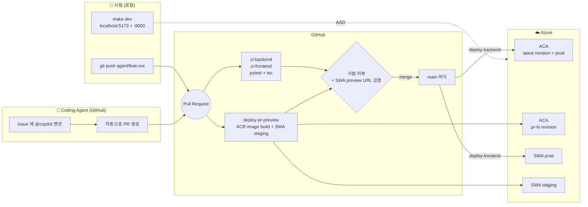

# Agentic DevOps — create-ad-cut

> **사람과 코딩 에이전트가 같은 main 브랜치를 공유하면서도 안전하게 병렬 개발하는 데모.**
>
> 로컬에서 즉시 띄울 수 있고, push 한 번에 GitHub Actions 가 Azure Container Apps + Static Web Apps 까지 자동 배포합니다. PR 마다 격리된 preview 환경이 자동 생성되어 사람이든 에이전트든 머지 전에 실제 URL 로 변경을 검증할 수 있습니다.

이 문서는 리포 전체를 *Agentic DevOps 데모* 관점에서 설명합니다. 앱 자체 기능 / 아키텍처는 [README.md](README.md), 인프라(IaC) 디테일은 [README.IaC.md](README.IaC.md) 를 참고하세요.

---

## 🎯 컨셉

**문제**: AI 코딩 에이전트가 메인 브랜치에 직접 손대면 위험합니다. 시크릿이 새거나, 인프라가 망가지거나, 사람과 충돌이 납니다.

**해법**: 4겹의 가드레일.

1. **브랜치 보호** — `main` 은 PR 머지만, CI 그린 + 1명 리뷰 필수
2. **CODEOWNERS** — `infra/`, `.github/workflows/` 는 사람만 승인 가능
3. **PR Preview** — PR 마다 격리된 ACA revision + SWA staging URL → 사람이 클릭 한 번으로 검증
4. **AAD-only 인증** — 코드에 키가 없음. 에이전트가 키 다룰 일 자체가 없음

이 4겹 위에서 사람은 로컬에서, 에이전트는 GitHub Issue/PR 로 동시에 일합니다.

---

## 🗺 전체 흐름



---

## ⚡ 빠른 시작

### 0. 1회 인프라 + 브랜치 보호 부트스트랩

```bash
# (1) 클라우드 리소스 한 번에 생성
azd auth login
az login
azd env new dev
azd env set AZURE_LOCATION eastus2
azd up

# (2) 본인 계정에 데이터 plane RBAC 부여 (로컬 dev 용)
make rbac

# (3) main 브랜치 보호 활성화 (한 번)
make protect
```

### 1. 평소 로컬 개발

```bash
make bootstrap   # backend/.env 생성 + venv + npm install
make dev         # backend + frontend 동시 기동 → http://localhost:5173
```

코드 수정 → `make test` → `git push origin agent/<slug>` → PR 열기 → SWA preview URL·CI 검증 → 리뷰 → 머지.

### 2. 에이전트 활성화

GitHub Repo 의 **Settings → Code & automation → Copilot** 에서 *Coding agent* 를 켜고:

- Issue 본문에 작업 설명 + `@copilot` 멘션, 또는 *Assign to Copilot* 클릭
- 에이전트가 `agent/<slug>` 브랜치를 만들고 PR 을 자동 생성
- CI + preview 워크플로우가 자동 실행
- 사람은 PR 댓글의 SWA preview URL 로 UI 검증 후 리뷰/머지 (backend 변경은 image build 게이트 + post-merge prod 반영 확인)

---

## 🛠 GitHub Actions 카탈로그

| Workflow | 트리거 | 동작 | 결과물 |
|---|---|---|---|
| [`ci-backend`](.github/workflows/ci-backend.yml) | PR + main push (`backend/**`) | `pytest` + `ruff check` + Docker build | ✅ 머지 게이트 |
| [`ci-frontend`](.github/workflows/ci-frontend.yml) | PR + main push (`frontend/**`) | `tsc` + `vite build` | ✅ 머지 게이트 |
| [`deploy-pr-preview`](.github/workflows/deploy-pr-preview.yml) | PR open/sync (`backend/**`) | ACR image build & push (no ACA revision) | 🐳 PR 댓글에 image 태그 |
| [`deploy-backend`](.github/workflows/deploy-backend.yml) | main push (`backend/**`) | ACR build → ACA revision (suffix `main-<sha>`) → 100% traffic | 🚀 prod 백엔드 |
| [`deploy-frontend`](.github/workflows/deploy-frontend.yml) | main push + PR (`frontend/**`) | SWA 빌드/배포 (prod or per-PR staging) | 🚀 prod / staging SWA |

모든 deploy 워크플로우는 **`concurrency` group** 으로 보호되어 동일 브랜치/PR 의 동시 배포 race 를 차단합니다.

---

## 🔐 시크릿 & 변수 매트릭스

GitHub Repo *Settings → Secrets and variables → Actions* 에서 설정합니다.

### Secrets (값은 절대 PR 본문/로그에 노출 금지)

| 이름 | 형식 | 용도 |
|---|---|---|
| `AZURE_CREDENTIALS` | Service Principal JSON (`az ad sp create-for-rbac --sdk-auth`) | ACR/ACA/Storage 컨트롤 plane 조작 |
| `SWA_DEPLOYMENT_TOKEN` | SWA 배포 토큰 | Static Web Apps 배포 |

### Variables

| 이름 | 예 | 용도 |
|---|---|---|
| `AZURE_RG` | `rg-dev` | 리소스 그룹명 |
| `ACR_NAME` | `acrdev3kf2x...` | Container Registry (with .azurecr.io 미포함) |
| `ACA_NAME` | `ca-dev-3kf2x...` | Container App 이름 |

> 모든 값은 `azd env get-values` 출력에서 가져올 수 있습니다 (`AZURE_RESOURCE_GROUP`, `ACR_NAME`, `BACKEND_NAME`).

---

## 🛡 가드레일 상세

### 브랜치 보호 (`scripts/setup-branch-protection.sh`)

`make protect` 가 다음을 활성화:

- ✅ 1명 이상 PR 리뷰 필수
- ✅ CODEOWNERS 리뷰 필수
- ✅ 새 커밋 시 기존 승인 자동 dismiss
- ✅ `ci-backend / test`, `ci-frontend / build` 그린 필수
- ✅ Linear history 강제, force push / 삭제 차단
- ✅ 대화 resolve 필수

### CODEOWNERS ([`.github/CODEOWNERS`](.github/CODEOWNERS))

다음 경로는 사람만 승인 가능:

- `.github/workflows/`
- `.github/copilot-instructions.md`
- `.github/CODEOWNERS`
- `/infra/`
- `azure.yaml`

> ⚠️ 사용 전 `@changjuahn` 을 실제 GitHub 핸들로 교체하세요.

### Coding Agent 규칙 ([`.github/copilot-instructions.md`](.github/copilot-instructions.md) §5)

에이전트는 다음을 자동으로 준수:

- PR 전용 작업, `main` 직푸시 금지
- 커밋 전 `pytest && ruff check . && npm run typecheck` 통과
- 시크릿을 코드/`.env`/주석에 절대 기록 금지
- 인프라/워크플로우 수정 시 PR 본문 첫 줄에 `⚠️ Restricted path change` 표기
- 새 의존성 추가 시 라이선스 명시

---

## 🧰 로컬 개발 명령어

| 명령 | 효과 |
|---|---|
| `make bootstrap` | `azd env get-values` → `backend/.env`, venv, npm install (멱등) |
| `make rbac` | 본인 계정에 Blob/AOAI/Cosmos 데이터 plane role 1회 부여 |
| `make dev` | 백엔드(:8000) + 프론트엔드(:5173) 병렬 기동 |
| `make backend` / `make frontend` | 개별 기동 |
| `make test` | `pytest` (백엔드 mock) + `tsc` |
| `make lint` | `ruff check` + `tsc` |
| `make protect` | main 브랜치 보호 1회 적용 |
| `make clean` | venv / node_modules / .env 제거 |

Windows 사용자: `scripts/bootstrap-local.ps1` 직접 호출.

---

## 🧪 PR Preview 동작 원리

두 쪽의 미리보기 전략은 다릅니다 — 이 레포의 EasyAuth (SWA Linked Backend) 특성 때문에 backend 직접 URL 은 reviewer 가 열 수 없으므로 **SWA preview 가 유일한 검증 경로** 입니다.

- **Frontend (SWA)** — `Azure/static-web-apps-deploy@v1` 이 `pull_request` 이벤트를 받으면 staging 환경을 자동 생성하고 PR 댓글에 URL 을 게시합니다. 마이크로서비스는 main 의 Linked Backend 로 돌아갑니다 — backend API 테스트는 prod 엔드포인트로 이뤄집니다.
- **Backend (ACA)** — PR 이 열릴 때 이미지를 ACR 로 빌드/푸시만 하고 ACA revision 은 만들지 않습니다. CI 테스트 + image build 통과가 backend 변경 게이트입니다. main 머지 시 `deploy-backend` 가 이 이미지를 prod ACA 에 배포합니다.

> **왜 label-based ACA preview 는 도입하지 않았나?** EasyAuth 가 SWA 도메인에 한정되어 있으므로 label FQDN (`<app>--pr-N.<env>`) 은 reviewer 가 직접 호출해도 401/404 를 반환합니다. revision을 만들 가치가 없고 (흐릅 trade-off 참고)

---

## 🚨 트러블슈팅

### SWA preview URL 이 표시안됨

- `SWA_DEPLOYMENT_TOKEN` secret 이 등록되었는지 확인 (`gh secret list --repo <owner/repo>`)
- `deploy-frontend` 의 preflight job 이 skip 으로 떨어졌으면 secret 미설정

### preview 이미지 빌드 실패 / 401

- GitHub Actions `AZURE_CREDENTIALS` SP 에 ACR `AcrPush` 권한이 있는지 확인
- `vars` 에 `ACR_NAME` 이 설정됐는지 — preflight job 이 명시적으로 fail 합니다

### 로컬에서 401 (Cosmos / Blob)

- `make rbac` 실행했는지
- 토큰 propagation 1~2분 대기. 그래도 안 되면 `az logout && az login`

### main 푸시는 됐는데 preview 가 안 생김

- 의도된 동작. preview 는 PR 트리거 전용 — main 푸시는 곧바로 prod 배포
- PR 을 통해 변경하면 항상 preview 가 먼저 뜸

### "Restricted path change" 인데 에이전트가 머지 시도

- CODEOWNERS 가 사람 승인을 강제하므로 GitHub 단에서 자동 차단됨
- 사람이 명시적으로 approve 해야만 머지 가능

---

## 📚 더 보기

- 앱 기능 / API / 프롬프트 디자인 → [README.md](README.md)
- 인프라 디테일 (Bicep, azd) → [README.IaC.md](README.IaC.md)
- 배포 운영 가이드 → [docs/deployment.md](docs/deployment.md)
- 아키텍처 다이어그램 → [docs/architecture.md](docs/architecture.md)
