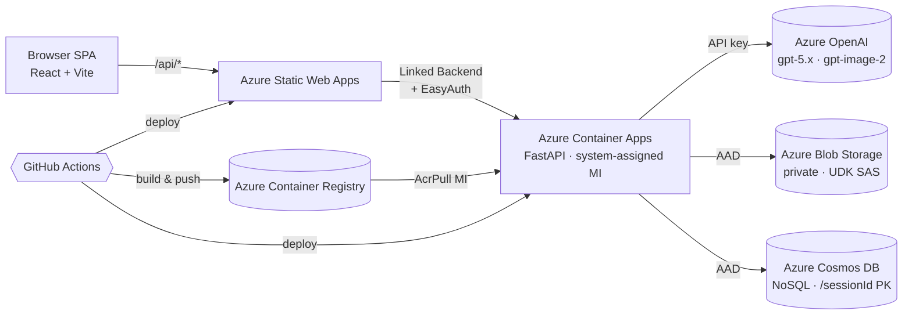

# create-ad-cut

> 상품 사진 1장 → GPT-5.x 분석 → 사람 검수 → GPT-image-2 로 **기본 4컷 + 커스텀 컷(최도 4개)** 광고 이미지 자동 생성.
> Azure Container Apps + Azure Static Web Apps + Cosmos DB + Blob Storage 풌스택 OSS.

[English summary →](./README.en.md)

이 리포는 [reference/index.html](reference/index.html) 의 워크플로우를 그대로 코드로 옮긴 오픈소스 구현체에서 이커머스 셀러용 기능을 확장한 버전입니다. 상품 사진 한 장으로 룩북 웩·정면·측면·후면 컷을 만들고, 원하는 장면(남자 모델, 야외 자연광 등)도 커스텀으로 추가하고, 마음에 안 들면 프롬프트를 고쳠 **재생성 · 비교**할 수 있습니다.

---

## ✨ 핵심 기능

- **분석**: Azure OpenAI `gpt-5.4` 또는 `gpt-5.5` 멀티모달이 상품 디테일을 한국어 `Output_Prompt` 로 정리 (자동 detail crop 7장 포함)
- **검수**: 사람이 textarea 에서 좌우 비대칭/색상 순서/가려진 부위만 빠르게 보정
- **생성**: Azure OpenAI `gpt-image-2` 로 기본 4컷(`lookbook`/`front`/`side`/`back`) **+ 커스텀 컷 최돀 4개**를 병렬 생성. 컷별 프롬프트를 각각 편집하고 `useReference` / `sceneCompose` 옵션으로 `images.edit` (high/low fidelity) 와 `images.generate` 를 자동 분기
- **재생성 + 비교**: 결과 페이지에서 컷별 프롬프트를 고쳐 재생성하면 기존 결과 뒤에 추가되고 좌우 슬라이드로 v1→v2→v3 비교 가능
- **저장/공유**: 원본 + 결과 이미지를 private Blob 컨테이너에 저장, 응답에는 15분 read-only **user-delegation SAS** 발급 (계정 키 사용 안 함)
- **인증**: Storage / Cosmos 는 모두 **AAD (DefaultAzureCredential)** — `disableLocalAuth` / `allowSharedKeyAccess=false` 정책 환경에서 그대로 동작
- **반응형 UI**: `max-w-screen-2xl` 기반 와이드 레이아웃, 컷 그리드는 `md:2 / xl:3` 아담퍼닝
- **배포**: Bicep + azd, GitHub Actions 로 백엔드(ACA)와 프론트엔드(SWA) 자동 배포

---

## 🏗 아키텍처



자세한 흐름은 [docs/architecture.md](docs/architecture.md) 를 참고하세요.

---

## 📦 사전 요건

| 항목 | 비고 |
|---|---|
| Azure 구독 | Owner 또는 Contributor + User Access Administrator (역할 부여 권한 필요) |
| **Azure OpenAI 리소스 (사전 배포)** | `gpt-5.4` 또는 `gpt-5.5`, `gpt-image-2` 두 개 deployment 필요. **이 리포의 IaC 는 AOAI 를 만들지 않습니다.** |
| Azure CLI | 최신 |
| azd (Azure Developer CLI) | 1.x (선택) |
| Node.js 20 | 프론트엔드 빌드 |
| Python 3.10+ | 백엔드 로컬 실행 |
| Docker (선택) | 로컬 컨테이너 빌드용 — 없으면 ACR Tasks (`az acr build`) 로 클라우드 빌드 |
| GitHub Repository Secrets | `AZURE_CREDENTIALS`, `AZURE_OPENAI_ENDPOINT`, `AZURE_OPENAI_API_KEY`, `BACKEND_API_KEY`, `SWA_DEPLOYMENT_TOKEN` |
| GitHub Repository Variables | `AZURE_RG`, `ACR_NAME`, `ACA_NAME` (provision 후 채움) |

---

## 🚀 빠른 시작

### 1) 사전 배포된 Azure OpenAI 정보 확보

이미 운영 중인 Azure OpenAI 리소스에서 다음 값을 메모합니다.

- 엔드포인트 URL: `https://<your-aoai>.openai.azure.com/`
- API Key
- 분석 모델 deployment 이름 (예: `gpt-5.4` 또는 `gpt-5.5`)
- 이미지 모델 deployment 이름 (예: `gpt-image-2`)

### 2) 인프라 + 백엔드 + 프론트엔드 배포

가장 간단한 길은 **azd**:

```pwsh
azd init -t .
azd env new dev
azd env set AZURE_LOCATION eastus2
azd env set AZURE_OPENAI_ENDPOINT  https://<your-aoai>.openai.azure.com/
azd env set AZURE_OPENAI_API_KEY   <your-aoai-key>
azd env set AZURE_OPENAI_ANALYSIS_DEPLOYMENT gpt-5.4
azd env set AZURE_OPENAI_IMAGE_DEPLOYMENT    gpt-image-2
azd env set BACKEND_API_KEY $(New-Guid)

azd up
```

azd 없이 단계별로 가는 방법, 그리고 첫 배포의 ACA placeholder 이슈
회복법은 [docs/deployment.md](docs/deployment.md) 를 참고하세요.

### 3) 데모

1. SWA hostname 접속
2. 상단 우측에서 **API Key 설정** → `BACKEND_API_KEY` 값 입력
3. 상품 사진 업로드 → 분석 결과 검수 → 4가지 모드 선택 → 결과 확인

---

## 🧪 로컬 개발

> 백엔드는 로컬에서도 **클라우드 Cosmos / Blob / AOAI** 에 직접 붙어 동작합니다.
> Cosmos / Storage 는 `disableLocalAuth=true` / `allowSharedKeyAccess=false`
> 정책에 맞춰 AAD 인증을 쓰므로, 본인 ID 에 데이터 plane RBAC 부여가 1회 필요합니다
> ([docs/deployment.md](docs/deployment.md) §2 참고).

### Backend

```pwsh
cd backend
python -m venv .venv; .\.venv\Scripts\Activate.ps1
pip install -e ".[dev]"
Copy-Item .env.example .env       # 값 채워 넣기 (계정 키 없음, 엔드포인트 + 계정 이름)
uvicorn app.main:app --reload
# Swagger UI: http://localhost:8000/docs   (모든 라우트는 /api 아래)
pytest
```

### Frontend

```pwsh
cd frontend
npm install
npm run dev
# http://localhost:5173 — Vite proxy 가 /api/* 를 localhost:8000 으로 그대로 전달
```

---

## 🗂 리포 구조

```
backend/    FastAPI 앱 (routes / services / prompts / tests / Dockerfile)
frontend/   React + Vite + TS SPA (4페이지 흐름)
infra/      Bicep modules + main + parameters
.github/    Actions workflows (ci-* x2, deploy-* x3)
docs/       아키텍처 / API / 프롬프트 설계 / 배포 가이드
reference/  원본 가이드 문서 (HTML)
```

---

## 📚 더 읽을 거리

- [docs/architecture.md](docs/architecture.md) — 데이터 흐름과 Cosmos 모델
- [docs/api.md](docs/api.md) — 엔드포인트별 cURL 예시
- [docs/prompt-design.md](docs/prompt-design.md) — system / user / style_headers 분리 원리
- [docs/deployment.md](docs/deployment.md) — SP 발급, secret 등록, 배포 트러블슈팅
- [reference/index.html](reference/index.html) — 원본 한국어 가이드

---

## ⚖ 라이선스

MIT — [LICENSE](LICENSE)
