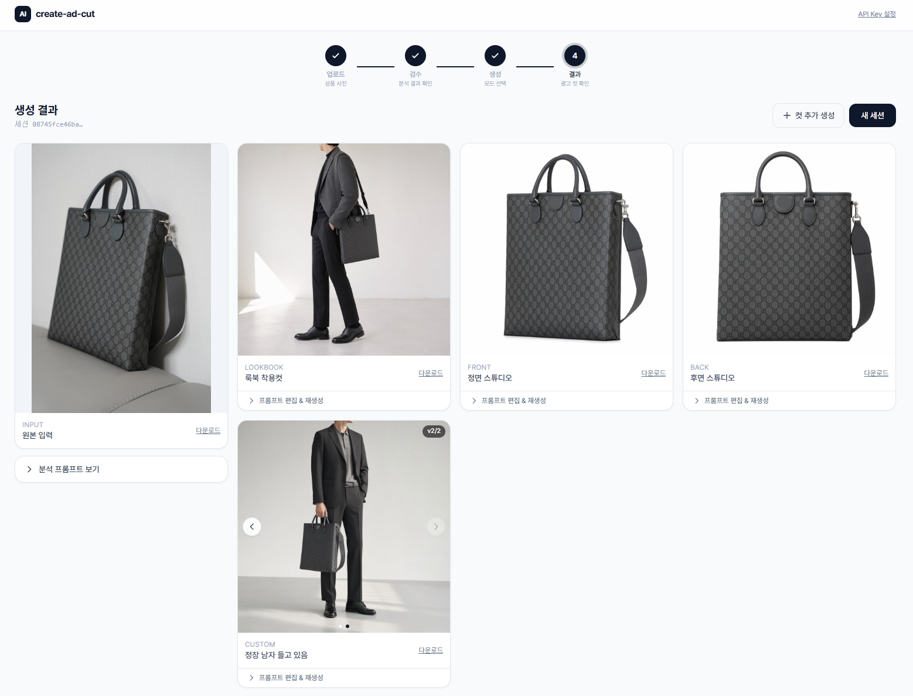
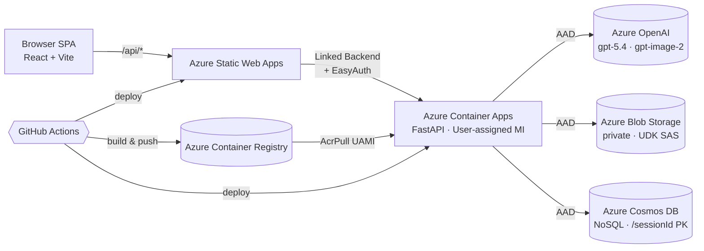

# create-ad-cut

> 상품 사진 1장 → GPT-5.x 분석 → 사람 검수 → GPT-image-2 로 **기본 4컷 + 커스텀 컷(최대 4개)** 광고 이미지 자동 생성.
> Azure Container Apps + Azure Static Web Apps + Cosmos DB + Blob Storage 풀스택 OSS.

[English summary →](./README.en.md)   [🏗 IaC 조감도 (azd / Bicep / Terraform / DevOps) →](./README.IaC.md)   [🔬 IaC 완전 정복 (cj edition) →](./README.IaC-cj.md)



이 리포는 [원본 한국어 가이드](https://ms.studydev.com/azure/ecommerce_product_studio/) 의 워크플로우를 그대로 코드로 옮긴 오픈소스 구현체에서 이커머스 셀러용 기능을 확장한 버전입니다. 상품 사진 한 장으로 룩북·정면·측면·후면 컷을 만들고, 원하는 장면(남자 모델, 야외 자연광 등)도 커스텀으로 추가하고, 마음에 안 들면 프롬프트를 고쳐 **재생성 · 비교**할 수 있습니다.

---

## ✨ 핵심 기능

- **분석**: Azure OpenAI `gpt-5.4` 멀티모달이 상품 디테일을 한국어 `Output_Prompt` 로 정리 (자동 detail crop 7장 포함)
- **검수**: 사람이 textarea 에서 좌우 비대칭/색상 순서/가려진 부위만 빠르게 보정
- **생성**: Azure OpenAI `gpt-image-2` 로 기본 4컷(`lookbook`/`front`/`side`/`back`) **+ 커스텀 컷 최대 4개**를 병렬 생성. 컷별 프롬프트를 각각 편집하고 `useReference` / `sceneCompose` 옵션으로 `images.edit` (high/low fidelity) 와 `images.generate` 를 자동 분기
- **프롬프트 레이아웃**: 룩북처럼 장면을 새로 지어야 하는 컷은 **샌드위치 프롬프트** 구조 (primacy 헤더 + 본문 + recency 최종지시) 로 조립 — 긴 분석 본문이 스타일 헤더를 압도하는 *Lost in the Middle* 현상을 회피하고 "사람 등장" 같은 강한 지시를 견고히 적용
- **재생성 + 비교**: 결과 페이지에서 컷별 프롬프트를 고쳐 재생성하면 기존 결과 뒤에 추가되고 좌우 슬라이드로 v1→v2→v3 비교 가능
- **저장/공유**: 원본 + 결과 이미지를 private Blob 컨테이너에 저장, 응답에는 15분 read-only **user-delegation SAS** 발급 (계정 키 사용 안함)
- **인증**: AOAI / Storage / Cosmos 모두 **AAD (User-assigned MI + DefaultAzureCredential)** — `disableLocalAuth` 정책 환경에서 그대로 동작. AOAI API 키 입력/복사 없음
- **반응형 UI**: `max-w-screen-2xl` 기반 와이드 레이아웃, 컷 그리드는 `md:2 / xl:3` 으로 화면 폭에 맞춰 정렬
- **배포**: Bicep + azd 로 일관된 IaC. `azd up` 한 번에 AOAI account/모델 deployment 까지 포함 생성

---

## 🏗 아키텍처



자세한 흐름은 [docs/architecture.md](docs/architecture.md) 를 참고하세요.

---

## 📦 사전 요건

| 항목 | 비고 |
|---|---|
| Azure 구독 | Owner 또는 Contributor + User Access Administrator (역할 부여 권한 필요) |
| Azure OpenAI quota | 배포 region 에서 분석 모델(`gpt-5.4`)과 이미지 모델(`gpt-image-2`) capacity 가 남아 있어야 합니다. 부족하면 region 변경 또는 quota 증액. **AOAI 자체는 이 IaC 가 만듭니다.** |
| Azure CLI | 최신 |
| azd (Azure Developer CLI) | 1.x |
| Node.js 20 | 프론트엔드 빌드 |
| Python 3.10+ | 백엔드 로컬 실행 |
| Docker (선택) | 로컬 컨테이너 빌드용 — 없으면 ACR Tasks (`az acr build`) 로 클라우드 빌드 |
| GitHub Repository Secrets | `AZURE_CREDENTIALS`, `BACKEND_API_KEY`, `SWA_DEPLOYMENT_TOKEN` (CI 사용 시) |
| GitHub Repository Variables | `AZURE_RG`, `ACR_NAME`, `ACA_NAME` (provision 후 채움) |

---

## 🚀 빠른 시작

### 1) 인프라 + 백엔드 + 프론트엔드 배포 — `azd up` 한 줄

포크 받아 들어왔다면 `azd init -t .` 는 실행하지 않습니다 (`azd init -t .` 는 템플릿 원본 폴더 밖에서 새 프로젝트를 만들 때만 사용).

Windows (PowerShell)

```pwsh
azd auth login
az login
azd env new dev
azd env set AZURE_LOCATION eastus2
azd up
```

macOS / Linux (zsh/bash)

```bash
azd auth login
az login
azd env new dev
azd env set AZURE_LOCATION eastus2
azd up
```

이게 끝입니다. AOAI 계정/모델 deployment, ACR, Storage, Cosmos, Container App, Static Web App 모두 IaC 가 만들고 백엔드 이미지까지 자동 배포합니다. `BACKEND_API_KEY` 도 환경별 결정적 해시로 자동 생성되어 ACA secret 으로 주입됩니다.

다른 모델/region/capacity 를 쓰고 싶다면 `azd up` 전에 다음 환경 변수를 덮어쓰세요.

```bash
# 예: 분석 모델을 gpt-5 / 다른 region / capacity 25 로
azd env set AZURE_OPENAI_LOCATION         eastus2
azd env set AZURE_OPENAI_ANALYSIS_MODEL   gpt-5
azd env set AZURE_OPENAI_ANALYSIS_MODEL_VERSION 2025-08-07
azd env set AZURE_OPENAI_ANALYSIS_CAPACITY 25
# 예: 이미지 모델을 gpt-image-1.5 로
azd env set AZURE_OPENAI_IMAGE_MODEL         gpt-image-1.5
azd env set AZURE_OPENAI_IMAGE_MODEL_VERSION 2025-12-16
azd env set AZURE_OPENAI_IMAGE_DEPLOYMENT    gpt-image-1.5
```

azd 없이 단계별로 가는 방법은 [docs/deployment.md](docs/deployment.md) 를 참고하세요.

### 2) 데모

1. SWA hostname 접속
2. 상단 우측에서 **API Key 설정** → `BACKEND_API_KEY` 값 입력 (관리자는 [docs/deployment.md §3](docs/deployment.md#3-backend_api_key-안내--어디에-입력하고-어디에서-가져오는가)에서 조회/회전 대일표 참고)
3. 상품 사진 업로드 → 분석 결과 검수 → 기본 4컷 + 커스텀 컷 선택 → 결과 확인

---

## 🧪 로컬 개발

> 백엔드는 로컬에서도 **클라우드 Cosmos / Blob / AOAI** 에 직접 붙어 동작합니다.
> Cosmos / Storage 는 `disableLocalAuth=true` / `allowSharedKeyAccess=false`
> 정책에 맞춰 AAD 인증을 쓰므로, 본인 ID 에 데이터 plane RBAC 부여가 1회 필요합니다
> ([docs/deployment.md](docs/deployment.md) §2 참고).

### Backend

Windows (PowerShell)

```pwsh
cd backend
python -m venv .venv; .\.venv\Scripts\Activate.ps1
pip install -e ".[dev]"
Copy-Item .env.example .env       # 값 채워 넣기 (계정 키 없음, 엔드포인트 + 계정 이름)
uvicorn app.main:app --reload
# Swagger UI: http://localhost:8000/docs   (모든 라우트는 /api 아래)
pytest
```

macOS / Linux (zsh/bash)

```bash
cd backend
python3 -m venv .venv
source .venv/bin/activate
pip install -e ".[dev]"
cp .env.example .env       # 값 채워 넣기 (계정 키 없음, 엔드포인트 + 계정 이름)
uvicorn app.main:app --reload
# Swagger UI: http://localhost:8000/docs   (모든 라우트는 /api 아래)
pytest
```

### Frontend

Windows (PowerShell)

```pwsh
cd frontend
npm install
npm run dev
# http://localhost:5173 — Vite proxy 가 /api/* 를 localhost:8000 으로 그대로 전달
```

macOS / Linux (zsh/bash)

```bash
cd frontend
npm install
npm run dev
# http://localhost:5173 — Vite proxy 가 /api/* 를 localhost:8000 으로 그대로 전달
```

---

## 🗂 리포 구조

```
backend/    FastAPI 앱 (routes / services / prompts / tests / Dockerfile)
frontend/   React + Vite + TS SPA (4페이지 흐름)
infra/      Bicep modules + main + parameters
.github/    Actions workflows (ci-* x2, deploy-* x3)
docs/       아키텍처 / API / 프롬프트 설계 / 배포 가이드
```

---

## 📚 더 읽을 거리

- **[README.IaC.md](README.IaC.md)** — Azure IaC 관점 종합 가이드 (azd / Bicep / Terraform 1:1 비교, 비즈니스 시나리오, GitHub Actions OIDC 예제)
- **[README.IaC-cj.md](README.IaC-cj.md)** — 솔루션 엔지니어용 IaC 완전 정복 (ARM 멘탈 모델, AWS↔Azure 매핑, drift/state, day-2 운영, gotchas 13개, FAQ)
- [docs/architecture.md](docs/architecture.md) — 데이터 흐름과 Cosmos 모델
- [docs/api.md](docs/api.md) — 엔드포인트별 cURL 예시
- [docs/prompt-design.md](docs/prompt-design.md) — system / user / style_headers 분리 원리
- [docs/deployment.md](docs/deployment.md) — SP 발급, secret 등록, 배포 트러블슈팅
- [원본 한국어 가이드](https://ms.studydev.com/azure/ecommerce_product_studio/) — 분석/생성 워크플로우 설계 노트

---

## ⚖ 라이선스

MIT — [LICENSE](LICENSE)
