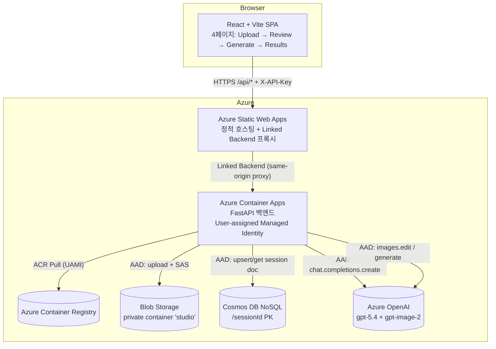

# 아키텍처 / 데이터 흐름

## 시스템 다이어그램



## 단계별 흐름

모든 라우트는 `/api` 접두사 아래에 있습니다. SWA Linked Backend 는
`/api/*` 를 ACA 로 stripping 없이 그대로 forward 합니다.

1. **Upload (`POST /api/sessions` + `POST /api/sessions/{id}/analyze`)**
   - 새 세션 생성, 입력 이미지를 `sessions/<id>/input.<ext>` 로 Blob 업로드
   - PIL 로 자동 detail crop 7장 생성 → 원본과 함께 멀티모달 요청
   - 응답에서 `Output_Prompt` 추출 → Cosmos `analysis.promptMd` 저장
2. **Review (`PATCH /api/sessions/{id}/prompt`)**
   - 프론트는 분석 결과를 textarea 로 보여주고, 사용자가 수정
   - 검수된 텍스트로 Cosmos `analysis.promptMd` 갱신
3. **모드 선택 · 프롬프트 편집 (`GET /api/style-headers`)**
   - 프론트가 빌트인 모드 4종의 라벨/설명/기본 스타일 헤더/`useReference`/`sceneCompose` 메타를 한 번에 가져와 각 컷 카드에 펼침·편집용으로 렌더
   - 사용자는 원하면 헤더 내용을 직접 고치거나, **커스텀 컷(최돀 4개)**를 완전히 자유롭게 추가 가능
4. **Generate (`POST /api/sessions/{id}/generate` → 202)**
   - 입력 메타 + 새 jobId 를 세션 문서의 `jobs[]` 에 임베딩 (최근 20개만 보관) 후 **비동기** 응답
   - 백그라운드 `asyncio.create_task` 로 입력 이미지를 Blob 에서 1번 다운로드하고
     `(스타일 헤더 + Output_Prompt)` 조합을 `useReference`/`sceneCompose` 에 따라
     `gpt-image-2 images.edit` (high/low fidelity) 또는 `images.generate` 로 **병렬 호출**
   - 각 완료 이미지를 `sessions/<id>/gen_<id>.png` 로 업로드 후 per-session asyncio 락 아래에서
     `generations` append + 해당 아이템 `status` 갱신
   - 결과는 **누적** (이전 generations 보존) → 결과 페이지에서 v1→v2→v3 비교 가능
5. **Job polling (`GET /api/sessions/{id}/generate/jobs/{jobId}`)**
   - 프론트가 3초 간격으로 상태를 모니터링 (`pending` → `running` → `done` / `failed`)
   - 전체 잡 상태: `running` → `done` / `partial` / `failed`. `running` 이 아닌 수간 다음 결과 페이지 로 이동
6. **Results (`GET /api/sessions/{id}`)**
   - Cosmos 문서를 다시 읽어 모든 generations 의 SAS URL 을 갱신해 반환

## 동시성 / 시간 예산

- 4컷 병렬 생성 = 서버 쥐에서 `asyncio.gather` + `images.edit` 호출.
- 단일 컷 평균 1~5분 → 4컷 동시 시 최악 5~6분. SWA Linked Backend 의
  HTTP 프록시 타임아웃(≈4분)을 넘을 수 있으므로 **생성 엔드포인트는 202 + jobId 로
  즉시 끊고 프론트가 3초 간격으로 GET 을 폴링**하는 패턴을 쓴다. 이로써 게이트웨이
  timeout 과 무관하게 실제 생성은 최대 12분까지 안전하게 기다릴 수 있다.
- AOAI 429 발생 시 해당 아이템만 `failed` 로 마킹되고 나머지 아이템은 계속 진행 → 전체 잡 상태는 `partial`.

## Cosmos DB 모델

- **Account**: NoSQL API, single region, Serverless capability
- **DB / Container**: `studio` / `sessions`
- **Partition Key**: `/sessionId` — 모든 read/write 가 단일 파티션 (cross-partition 쿼리 0건)
- **Embedded document**:

  ```json
  {
    "id": "<sessionId>",
    "sessionId": "<sessionId>",
    "createdAt": "...",
    "updatedAt": "...",
    "input":   { "blob": "sessions/<id>/input.png", "contentType": "image/png" },
    "analysis": {
      "promptMd": "...",
      "model": "gpt-5.5",
      "analyzedAt": "...",
      "reviewedAt": "..."
    },
    "generations": [
      {
        "id": "9a4b7c1e2f30",
        "mode": "lookbook",
        "label": "룩북 착용컷",
        "blob": "sessions/<id>/gen_9a4b7c1e2f30.png",
        "promptHeader": "이 이미지는 반드시 사람이 등장하는 패션 착용컷...",
        "usedPrompt": "...",
        "createdAt": "..."
      },
      { "id": "...", "mode": "front", "label": "정면 스튜디오", ... },
      { "id": "...", "mode": "custom", "label": "남자 모델 룩북", ... }
    ]
  }
  ```

  > 한 세션의 모든 데이터를 한 문서에 임베딩 — 항상 함께 조회되며, 2 MB 제한과 거리가 멀어 안전합니다. **`generations` 는 append-only**로 동일 컷을 재생성해도 이전 버전이 보존됩니다.

## 보안 / Secrets

- 외부 → 백엔드: `X-API-Key` 헤더 검증
- 백엔드 → AOAI / Storage / Cosmos: **AAD via DefaultAzureCredential (User-assigned MI)**
  - 로컬: 개발자의 `az login` ID
  - 클라우드: ACA 에 attach 된 **User-assigned Managed Identity**
  - AOAI 는 `Cognitive Services OpenAI User`, Storage 는 `Storage Blob Data Contributor`, Cosmos 는 `Cosmos DB Built-in Data Contributor` 역할을 IaC 가 UAMI 에 부여
  - 정책 환경 (`disableLocalAuth=true` / `allowSharedKeyAccess=false`) 대응 표준 — AOAI API 키 복사/입력 없음
- ACA → ACR: User-assigned Managed Identity + AcrPull (UAMI 를 먼저 만들고 RBAC 부여 후 ACA 를 생성해 첫 배포부터 경합 제거)
- SWA → ACA: Linked Backend 가 ACA 에 EasyAuth 를 자동 활성화 → 외부 직접
  호출 차단, SWA hostname 만 통과
- Blob SAS: 계정 키 사용 안 함. **User Delegation Key** (AAD 서명) 로
  매 요청마다 15분 짜리 read SAS 발급
